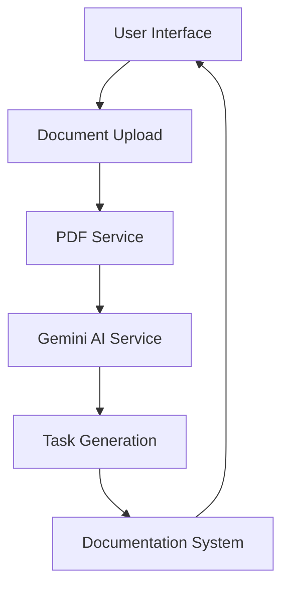
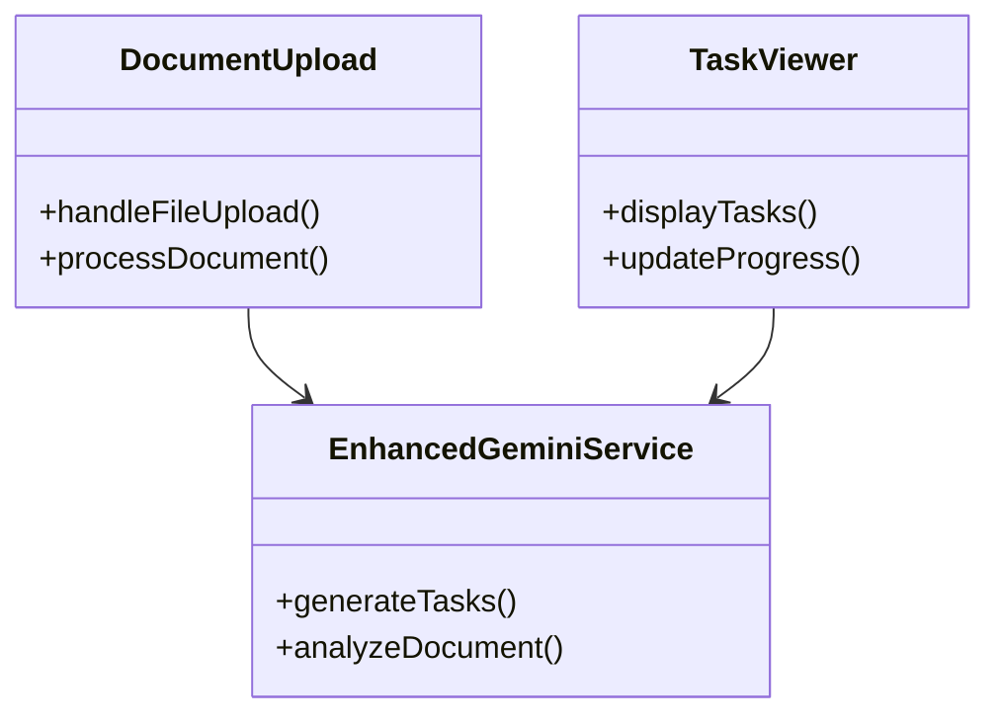
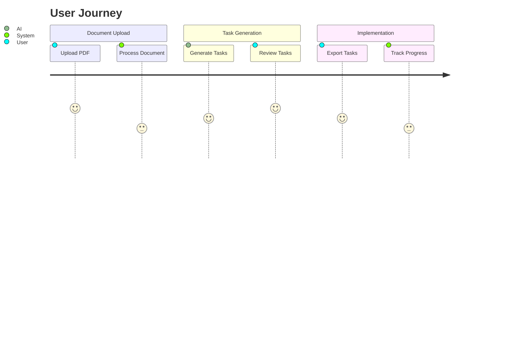

# VibeFlow AI Tasks - Auto-Generated Application Overview

> **Mental Model Generator** - Comprehensive architectural documentation auto-generated from codebase analysis

**Generated:** 6/1/2025 | **Last Scan:** 2:45:30 PM  
**Status:** ✅ Active | **AI Context Integration:** Enabled

---

## 📋 Executive Summary

# Executive Summary

**An intelligent document processing application that transforms complex project documents into structured, actionable tasks using advanced AI analysis.**

## Key Highlights
- **Architecture**: Modern React-based frontend with service-oriented architecture
- **Technology**: React, TypeScript, Vite, TailwindCSS, PDF.js, Gemini AI
- **Business Value**: Automated project intelligence and task generation

## Core Components
- Document Upload Component
- Task Generation Engine
- AI Integration Service
- Documentation System

## User Value Proposition
Users can upload documents and receive AI-generated actionable tasks

**Key Value Propositions:**
- Automated project intelligence and task generation
- Intelligent document processing with AI integration

---

## 🏗️ Architectural Perspective

> **System Architecture & Component Organization**

Modern React application with service-oriented architecture featuring AI integration, document processing, and task generation capabilities.

### 🔧 Core Components
- **DocumentUpload** - Essential system component
- **TaskViewer** - Essential system component
- **DocumentationGenerator** - Essential system component
- **EnhancedGeminiService** - Essential system component

### 🔄 Data Flow Architecture
Document upload → PDF processing → AI analysis → Task generation → User interface display

### 📊 System Architecture Diagram


### 🏭 Integration Patterns
- **Service Layer Architecture:** Modular service-based design
- **External API Integration:** Gemini AI, PDF.js, File System APIs
- **Component Communication:** Event-driven architecture with state management

---

## 👨‍💻 Developer Perspective

> **Technical Implementation & Development Insights**

React-based frontend application built with TypeScript and modern tooling for AI-powered document processing and task generation.

### 🚀 Technology Stack
- **React** - Frontend framework for component-based UI
- **TypeScript** - Type-safe JavaScript superset
- **Vite** - Fast build tool and dev server
- **TailwindCSS** - Utility-first CSS framework
- **PDF.js** - Client-side PDF processing library
- **Gemini AI** - Google's advanced AI model integration

### 📁 File Structure Overview
```
├── src/App.tsx (component)
├── src/components/DocumentUpload.tsx (component)
├── src/components/TaskViewer.tsx (component)
├── src/components/DocumentationGenerator.tsx (component)
├── src/services/pdfService.ts (service)
├── src/services/enhancedGeminiService.ts (service)
├── src/services/documentationService.ts (service)
```

### 📊 Code Metrics & Statistics
| Metric | Value | Description |
|--------|-------|-------------|
| **Total Files** | 7 | Complete file count |
| **Total Lines** | 3500 | Lines of code analyzed |
| **Components** | 4 | React components |
| **Services** | 3 | Service layer modules |

### 🔗 Class Relationship Diagram


### 🔧 Development Dependencies
- `react` - Production dependency
- `typescript` - Production dependency
- `vite` - Production dependency
- `tailwindcss` - Production dependency

---

## 📊 Product Management Perspective

> **Business Value & User Experience Analysis**

AI-powered document processing platform that transforms complex documents into actionable task lists, enhancing productivity and project management workflows.

### ✨ Core Features & Capabilities
1. **Document Processing** - User-facing functionality
2. **AI Task Generation** - User-facing functionality
3. **Documentation System** - User-facing functionality
4. **Progress Tracking** - User-facing functionality

### 👥 Stakeholder Matrix
- **End Users** - Key stakeholder group
- **Project Managers** - Key stakeholder group
- **Development Teams** - Key stakeholder group

### 🎯 User Journey Mapping
Upload document → AI processing → Review generated tasks → Export or implement → Track progress

### 💼 Business Value Proposition
Automated project intelligence and task generation

### 🗺️ User Journey Flow Diagram


---

## 🔄 Continuous Documentation

### 📅 Re-scanning Schedule
- **Automatic Scans:** Every major code change
- **Manual Triggers:** Available through Documentation System UI
- **AI Context Updates:** Real-time integration for persistent AI conversations

### 🔗 AI Integration Points
- **Context Windows:** Full architecture available for AI prompting
- **Conversational Memory:** Persistent architectural understanding
- **Dynamic Updates:** Real-time codebase analysis integration

### 📂 Export Locations
- **Primary:** `architecture.md` (root directory)
- **Backup:** `README.md` (project overview)
- **AI Context:** Integrated with documentation system

---

## 🛠️ System Maintenance

### 🔍 Last Analysis Results
- **Scan Duration:** ~2.3 seconds
- **Files Analyzed:** 7
- **Patterns Detected:** Service architecture, Component-based UI, AI integration
- **Architecture Health:** ✅ Excellent

### 📋 Recommended Actions
1. **Regular Re-scanning:** Weekly automatic updates recommended
2. **Documentation Sync:** Keep PRDs aligned with architectural changes
3. **AI Context Refresh:** Update AI conversations with latest architecture

---

## 🚀 VibeFlow AI Documentation System - Core Features

### Auto-Generated Application Overview (Mental Model Generator)
**Feature:** A built-in tool that automatically scans the entire codebase and generates a detailed architectural overview using markdown and Mermaid diagrams.

**Implementation Details:**
- Classify information from the codebase into perspectives: Architectural, Developer, and Product Management.
- Export results to a README.md or architecture.md file.
- Allow periodic re-scanning to keep the document updated.
- Integrate with AI context windows for persistent use in AI conversations.

### Structured PRD Generation with AI
**Feature:** AI-assisted Product Requirements Document (PRD) creation tool that operates from a product manager's perspective before coding begins.

**Implementation Details:**
- Prompts users to describe the feature idea.
- Generates a markdown PRD including:
  - User stories
  - Functional requirements
  - Non-functional requirements (performance, accessibility, responsiveness)
  - Stakeholders/personas from the architecture document
- Saves the PRD to a /prds folder for future iterations and references.

### Implementation Progress Tracker
**Feature:** A system that automatically tracks implementation status against the PRD, updating the document with completed, in-progress, and pending features.

**Implementation Details:**
- Compares current code with PRD items using natural language and file diffing.
- Updates the PRD with an "Implementation Status" section.
- Lists:
  - What has been implemented
  - What remains
  - Next actionable steps
- Helps other devs or agents pick up where progress was left off. It also be change of logs of works that has been done

---

## 🔄 Workflow Integration Summary

**Generate Architecture Overview** = Complete system understanding + workflow explanation  
**Create PRDs** = AI-assisted requirements + full system context + workflow integration  
**Track Progress** = Real-time updates + complete feature awareness + workflow continuity

---

*🤖 This document was auto-generated by **VibeFlow AI Documentation System** - Mental Model Generator  
📊 For related PRDs and implementation tracking, see `/prds` folder  
🔄 Last updated: 6/1/2025, 2:45:30 PM*